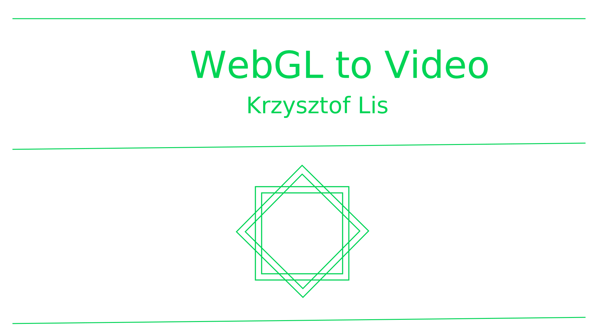
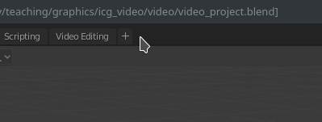
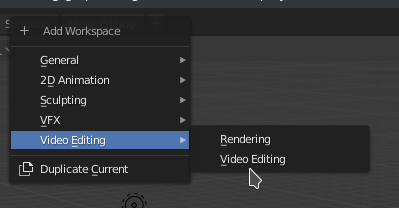
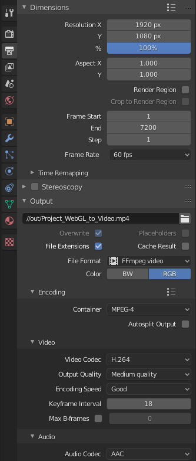
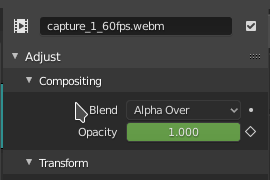
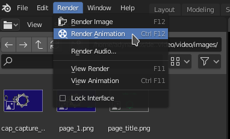

# ICG Project Video

<!-- <video src="video/out/Project_WebGL_to_Video.mp4" controls="true" width="640" ></video> -->

<a href="video/out/Project_WebGL_to_Video.mp4?raw=true"></a>

The detailed information about the ICG project video is [here](https://lgg.epfl.ch/teaching/ICG20/icg_lectures/2021_project_instructions/#final-presentation-video), in summary:

* 2 minutes in length
* Display the project title and the group member names in the first 5 seconds (There can be an image or video in the background, just please make it readable)
* 1920x1080 resolution, preferably 60 frames per second
* MP4 container with H264 encoding (we ask everyone for the same codec so that we can concatenate the videos without lossy re-encoding, h264 is a popular codec and can be played by web browsers)
* Choose which elements best demonstrate your achievement - for example video of the rendering, recording of an interactive session, slides about the technical side etc...
* Your commentary: recorded audio or subtitles (or both). In the commentary, please describe what your project is doing and how you achieved it.

If you do not have previous experience with video capture and editing, we compiled some advice and examples here.
We also provide code and instructions for capturing video in the WebGL framework.
  

# Recording

The usual way to record video is capturing the frames displayed on screen with sofware like [OBS](https://obsproject.com/).
If that works for you, that is very well.

However, if the rendering is not running fast enough, the resulting captured video will not be smooth.
Below we describe some ways to address this.

## Images

Ideally we would instruct our program to save each frame of the simulation into a separate image file.
Then these images can be combined into a video.
For example CPU-based ray-tracing runs way below real time and is handled this way.

Combining images using [FFmpeg](https://ffmpeg.org/):
```bash
ffmpeg -f image2 -framerate 60 -i 'frame_%03d.png' -c:v libx264 -preset slow -crf 25 -pix_fmt yuv420p out.mp4
```

More on that topic:

* [FFmpeg image sequence](https://en.wikibooks.org/wiki/FFMPEG_An_Intermediate_Guide/image_sequence)
* [FFmpeg H264 encoding](https://trac.ffmpeg.org/wiki/Encode/H.264)

## Recording in our WebGL framework

The WebGL+regl.js exercises run in a browser so we can not write arbitrary image files to the disk.
We have prepared a script that you can include in your project to save video from our WebGL exercise framework.

This mechanism allows you to run and control your project interactively while also recording the video.
The mechanism is illustrated in this example project, please see [`main.js`](./src/main.js) and [`icg_screenshot.js`](./src/icg_screenshot.js).


### Adapt your project code for video recording

The usage of the video recording script is shown in [`main.js`](./src/main.js).


* Include [`icg_screenshot.js`](./src/icg_screenshot.js) in your `main.js`
```js
import {CanvasVideoRecording} from "./icg_screenshot.js"
```

* Set the size of the canvas to the desired video resolution
```js
canvas_elem.width = 1920;
canvas_elem.height = 1080;
```

* Create a video recording object
```js
const video = new CanvasVideoRecording({
	canvas: canvas_elem,
	// videoBitsPerSecond: 250*1024, // tweak that if the quality is bad 
	// https://developer.mozilla.org/en-US/docs/Web/API/MediaRecorder/MediaRecorder
});
```

* Copy the `video_start_stop` function from [`main.js`](./src/main/js).
Calling it the first time starts the recording, the second call finishes it.
By default we bind it to the **R** key: 
```js
register_keyboard_action('r', video_start_stop);
```

* In your render loop, parametrize the scene by the *number of the current frame* `frame.tick` amd not by `frame.time`.
This way the *n*-th frame will always look the same, regardless how fast your GPU is.

* In the render loop, do `video.push_frame()`.


### Recording process

Press **R** to start recording and then press **R** again when the recording is finished.

The videos will be shown in the overlay. Right-click a video and <em>Save video as</em> to download it.
In the example project, we save the video to `video/recordings/capture_1_from_browser.webm`.

If you see compression artifacts in your saved video, increase the bitrate `videoBitsPerSecond`.

These videos will be very big, but do not worry.
The reason for their size is that video-encoding is a computationally intensive process - the browser cannot do good compression in real time.
However, this video file is only an intermediate step. Your video editor will re-encode it and the final presentation file will be of reasonable size.

### Fixing the video file

Unfortunately, the file produced by the `MediaRecorder` is flawed and we need to fix it before the next step.

Firstly, it seems to be missing some metadata/headers, it can be played but fails to load in video editors (I tested Blender and Kdenlive).

Secondly, the *timestamps* of the frames are most probably wrong.
When the video is written by `MediaRecorder`, each frame is put at the *real time* that it was captures.

Our rendering often runs below real-time, especially with the additional burden of the recording process.
Therefore, we want the frames to be played *faster* than according to the times they were taken.
If it takes 0.5s to render a frame, the frames will be stored at `0.0 0.5 1.0 ...` but we want them to be played at `0/60 1/60 2/60 ...`.

We need to rewrite the frame timestamps. 
This is a somewhat unusual operation (FFmpeg cannot do it), but fortunately it is implemented by the [MKVToolNix](https://mkvtoolnix.download/) tool.

**Install MKVToolNix**

* Linux: `sudo apt install mkvtoolnix` or [download AppImage](https://www.fosshub.com/MKVToolNix.html)
* Windows: [Windows download](https://www.fosshub.com/MKVToolNix.html)
* Mac: [`brew installl mkvtoolnix`](https://formulae.brew.sh/formula/mkvtoolnix#default) or [download file](https://www.fosshub.com/MKVToolNix.html)

**Rewrite the timestamps**

```bash
cd video/recordings
mkvmerge --default-duration 0:60fps capture_1_from_browser.webm -o capture_1_60fps.webm
```

The resulting `capture_1_60fps.webm` file now plays smoothly and can be used in the video editing process.


# Editing

In this step we combine the captured videos, images, slides, diagrams into a 2 minute video.

There is a variety of video editing tools: GUI (I know [Kdenlive](https://kdenlive.org), [OpenShot](https://www.openshot.org/), [Blender](https://www.blender.org/) but there are many more) or programmatic ([FFmpeg concatenate](https://trac.ffmpeg.org/wiki/Concatenate), [moviepy](https://zulko.github.io/moviepy/)).

Here we provide an example video editing project in the [`video`](./video) directory:

* `video/video_project.blend` - Blender project file
* `video/recordings` - captures from the previous section
* `video/images` - title screen and diagram slide used in the presentation. I made them with [Inkscape](https://inkscape.org/) and exported to PNG, Blender seems to need PNG images.
* `video/out` - here the output video is saved.

## Blender 

We have used [Blender](https://www.blender.org/) for modelling, but it also has a video editing module.

[Blender 2.8 Video Editing](https://www.youtube.com/playlist?list=PLlXsqAWo0V6IiiThMKxaezET2sdO7grjQ) Tutorial

### Tips for Blender video editing

* Open the video-editing layout

 


* Set the video duration. Blender uses frame numbers to denote time, so we put `num_seconds * 60` here.
The presentation videos is usually 2 minutues, so put `120 * 60` there.
You can write `120 * 60` into the box and Blender will understand the multiplication.

* Output options  
File location: `//out/result.mp4`. `//` means *relative to blender file*.  
File format: FFmpeg video  
Container: MPEG-4  
Codec: H.264  
Audio: AAC  



* Open the project folder in the top-left file-browser, drag videos and images from there

* Put a black background  (*Add->Color*) behind the video (on the lowest track), so that fade-out fades to black.

* Set the blending mode of all fragments to *alpha over*, it produces intuitive blending rules.



* Create text with *Add -> Text*

* Produce the output video with *Render -> Render animation*.



<!-- * [Beginner Video Editing Tutorial Using Blender 2.8](https://www.youtube.com/watch?v=bvr54FtfYl4) -->


## Audio / Commentary

Usually we ask you to comment the video live during the event, but the lack of in-person meeting makes that infeasible this year.

Therefore, **please include your commentary as recorded audio or subtitles (or both)**.
In the commentary, please describe what your project is doing and how you achieved it.


I did not have much to say in the example project so instead I included creative-commons music generously provided by [Kevin MacLeod](https://incompetech.com/):

The Cannery by Kevin MacLeod  
Link: <https://incompetech.filmmusic.io/song/4485-the-cannery>  
License: <http://creativecommons.org/licenses/by/4.0/>  

But for the project we would love to hear what *you* have to say about it.
